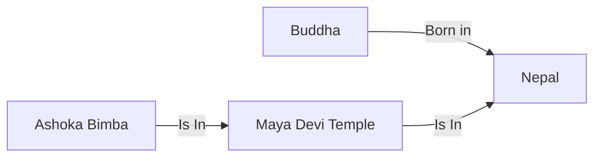

==[[2026-01-12]]==

# Neo4j
## Graph DataBase
Graph databases store data as **nodes** and relationships instead of tables, which makes traversing complex, highly connected data efficient.
They are well suited for use cases like social networks, recommendation engines, knowledge graphs, and fraud detection where relationships are first-class citizens.

## Applications of Graph DataBase
## GraphRAG
GraphRAG enriches retrieval-augmented generation by storing documents and entities as nodes and edges, letting LLMs retrieve context via graph traversal.
This improves reasoning over long-term, structured knowledge such as concepts, people, and events compared with flat vector-only retrieval.

## PageRank
PageRank computes the relative importance of nodes in a graph by iteratively propagating scores along outgoing links.
In knowledge and web graphs, higher PageRank nodes often represent more influential or authoritative entities.

## Neo4j: Introduction
Neo4j is a native graph database where data is stored as nodes, relationships, and properties, all optimized for graph traversal.
It supports ACID transactions, flexible schema, and horizontal scaling options via Neo4j Aura and clustering.

## Labels in Neo4j
Labels categorize nodes into types, such as `:Person`, `:Country`, or `:Temple`, allowing efficient indexing and querying.
A node can have multiple labels, enabling polymorphic modeling like `(:Person:Author)`.

## CYPHER Query Language
Cypher is Neo4j’s declarative query language designed around ASCII-art graph patterns like `(a:Person)-[:KNOWS]->(b:Person)`.
It supports matching, creating, updating, and aggregating graph data through concise pattern-based syntax.

## ACSCII Notation for nodes and relationships
- Nodes use parentheses: `(n:Label {property: value})`.
- Relationships use arrows between nodes: `(a)-[:TYPE {prop: value}]->(b)` for directed edges, or `--` for undirected.

## MATCH keyword
**Use Case:**  
Use `MATCH` to read or traverse existing graph patterns without modifying data, optionally filtering with `WHERE` and returning results.

**Syntax:**
```cypher
MATCH (n:Label)-[r:REL_TYPE]->(m:OtherLabel) WHERE n.property = $value RETURN n, r, m;
```

## CREATE Keyword
**Use Case:**  
Use `CREATE` to insert new nodes and relationships into the graph according to a specified pattern.

**Syntax:**
```cypher
CREATE (n:Label {prop1: $val1, prop2: $val2}) CREATE (n)-[:REL_TYPE {relProp: $relVal}]->(m:OtherLabel);
```
## DELETE Keyword
**Use Case:**  
Use `DELETE` to remove nodes or relationships that have been matched in the query
> [!note] Use `DETACH DELETE` to remove nodes plus their relationships.

**Syntax:**
```cypher
MATCH (n:Label {prop: $value}) DETACH DELETE n;
```

## MERGE Keyword
**Use Case:**  
Use `MERGE` to “upsert” patterns: it matches existing nodes/relationships or creates them when they do not yet exist.

**Syntax:**
```cypher
MERGE (n:Label {key: $value}) ON CREATE SET n.createdAt = timestamp() ON MATCH  SET n.lastSeen  = timestamp()`
```

## Creating an example graph


**Code:**
```cypher
// ---------- CREATE / MERGE / MATCH: build the graph ----------

MERGE (n:Country {name: 'Nepal'});

CREATE (b:Buddha {name: 'Buddha'})
MERGE  (m:Temple {name: 'Maya Devi Temple'})
CREATE (a:Artifact {name: 'Ashoka Bimba'});

// Create relationships using MATCH
MATCH (b:Buddha {name: 'Buddha'})
MATCH (n:Country {name: 'Nepal'})
CREATE (b)-[:BORN_IN]->(n);

MATCH (a:Artifact {name: 'Ashoka Bimba'})
MATCH (m:Temple {name: 'Maya Devi Temple'})
CREATE (a)-[:IS_IN]->(m);

MATCH (m:Temple {name: 'Maya Devi Temple'})
MATCH (n:Country {name: 'Nepal'})
CREATE (m)-[:IS_IN]->(n);

// ---------- DELETE: remove relationships and nodes ----------

MATCH ()-[r]->()
DELETE r;

MATCH (b:Buddha)
DETACH DELETE b;

MATCH (a:Artifact)
DETACH DELETE a;

MATCH (m:Temple)
DETACH DELETE m;

MATCH (n:Country)
DETACH DELETE n;
```